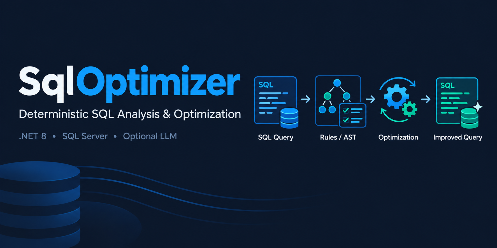
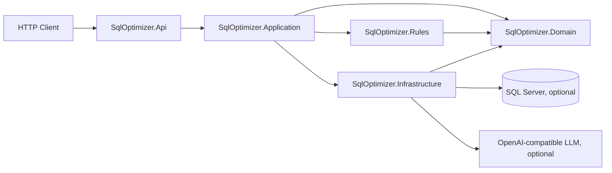

# SqlOptimizer
<p align="center">
  <a href="https://paypal.me/TheMaxLab">
    
  </a>
</p>

**Deterministic SQL query optimizer and static analyzer for Microsoft SQL Server, written in C# on .NET 8** — available as an ASP.NET Core REST API and as a local Windows Forms desktop application.

SqlOptimizer is a SQL Server optimizer and query analyzer for SQL performance tuning. It parses T-SQL into an AST, lints the query against 20 deterministic optimization rules (`SQL001`–`SQL020`), scores complexity and performance risk, generates and ranks rewritten SQL candidates, and validates candidate semantics with explicit, evidence-based outcomes. LLM-assisted optimization and database-aware analysis (schema metadata, execution plans, runtime result comparison) are optional; the deterministic core works completely offline — no LLM and no database required.



> **Current verified status:** 14/14 projects build · **651/651 offline tests passing** · 51 SQL Server integration tests are Docker-dependent and not part of the offline baseline (see [Docker-dependent integration tests](#docker-dependent-integration-tests)).

## Table of contents

- [Features](#features)
- [Architecture](#architecture)
- [SQL optimization rules](#sql-optimization-rules)
- [API](#api)
- [Windows desktop application](#windows-desktop-application)
- [Desktop Engine](#desktop-engine)
- [Requirements](#requirements)
- [Getting started](#getting-started)
  - [Build](#build)
  - [Run the API](#run-the-api)
  - [Run the Windows Forms application](#run-the-windows-forms-application)
  - [Run tests](#run-tests)
- [Project structure](#project-structure)
- [Configuration](#configuration)
- [Optional LLM integration](#optional-llm-integration)
- [Optional database integration](#optional-database-integration)
- [Validation model](#validation-model)
- [Docker-dependent integration tests](#docker-dependent-integration-tests)
- [Current project status](#current-project-status)
- [Development and CI](#development-and-ci)
- [Contributing](#contributing)
- [Security](#security)
- [License](#license)

## Features

- **Deterministic SQL static analysis** of T-SQL: parsing, AST, 20 SQL linting rules (`SQL001`–`SQL020`), deterministic complexity and performance-risk scoring (0–100), and structural query statistics.
- **SQL query optimization pipeline**: deterministic optimization plan, rewritten SQL candidates with explanations, candidate ranking, index recommendations, and explicit pipeline-level limitations.
- **LLM-assisted SQL optimization (optional)**: OpenAI-compatible providers and a mock provider; LLM candidates are untrusted and ranked together with deterministic ones. Without an LLM the pipeline is fully functional.
- **Database-aware SQL optimization (optional)**: SQL Server schema metadata, index information, execution plans, and runtime result comparison behind a read-only execution guard.
- **Evidence-based validation**: syntax, structure, semantic-risk analysis, and optional runtime result comparison. `NotExecuted` and `Inconclusive` are first-class outcomes — semantic equivalence is only claimed when a runtime comparison proves it.
- **REST API** (ASP.NET Core minimal API on .NET 8): `analyze`, `optimize`, `validate`, and `health` endpoints with RFC 7807 Problem Details, stable error codes, optional API-key authentication, per-client rate limiting, request-body limits, and Swagger/OpenAPI in Development.
- **Local Windows desktop application** (Windows Forms on .NET Framework 4.8) that talks to a local .NET 8 engine sidecar over stdin/stdout JSON — no HTTP, no localhost endpoints, no ASP.NET required.
- **Secure by design**: no arbitrary SQL execution endpoint, read-only runtime guard, secrets only in configuration, no fabricated validation results.

## Architecture

SqlOptimizer follows a pragmatic Clean Architecture structure:



The desktop client follows a separate local-process path (see [Desktop Engine](#desktop-engine)): the WinForms application does not reference .NET 8 assemblies and does not call the HTTP API. It starts a .NET 8 console sidecar that hosts the same Application/Rules/Infrastructure pipeline and communicates over local stdin/stdout JSON.

### Source projects

| Project | Responsibility |
|---|---|
| `SqlOptimizer.Domain` | Core models, SQL AST, visitors, analysis findings, rules contracts, exceptions |
| `SqlOptimizer.Rules` | The 20 deterministic optimization rules, rule registry, deterministic score engine |
| `SqlOptimizer.Application` | Analyzer, optimizer, validator, candidate generation/ranking, optimization plan, DTOs, options |
| `SqlOptimizer.Infrastructure` | T-SQL parser, SQL Server database provider, LLM clients, read-only guard, result comparator |
| `SqlOptimizer.Api` | ASP.NET Core minimal API: thin endpoints, middleware, health, OpenAPI |
| `SqlOptimizer.Desktop` | Windows Forms desktop client targeting .NET Framework 4.8 |
| `SqlOptimizer.Desktop.Engine` | .NET 8 console sidecar that hosts the same application pipeline for the desktop client |

### Test projects

| Project | Responsibility |
|---|---|
| `SqlOptimizer.Domain.Tests` | Domain model, AST and rule-registry tests |
| `SqlOptimizer.Rules.Tests` | One test class per rule plus score-engine tests |
| `SqlOptimizer.Application.Tests` | Analyzer, optimizer, validator and candidate pipeline tests |
| `SqlOptimizer.Api.Tests` | Endpoint contracts, middleware, authentication, rate limiting |
| `SqlOptimizer.Infrastructure.Tests` | Parser, providers, LLM clients, read-only guard, result comparator |
| `SqlOptimizer.Api.IntegrationTests` | Live API integration tests against a SQL Server container |
| `SqlOptimizer.Infrastructure.IntegrationTests` | Live SQL Server infrastructure integration tests |

### Core principles

- The domain layer has no dependency on ASP.NET Core, SQL Server, or LLM providers.
- SQL analysis is deterministic: same input, same findings.
- Rules are isolated, stateless, and independently testable.
- Database access and LLM access are optional and configuration-gated.
- A finding is a diagnosis, a candidate is a proposal, and only runtime validation may prove semantic equivalence.
- Generated SQL is treated as untrusted.
- Runtime validation is explicit, guarded, and configuration-gated.

## SQL optimization rules

SqlOptimizer ships 20 deterministic SQL rules, registered centrally in `SqlOptimizer.Rules` and executed by the application analysis pipeline. Every finding carries the rule ID, severity, category, explanation, recommendations, a 0–1 confidence, and estimated impact dimensions. Rules never claim a measured cost they did not measure: caveats are explicit.

| ID | Rule |
|---|---|
| `SQL001` | Select Star |
| `SQL002` | Function on Column |
| `SQL003` | Non-SARGable Predicate |
| `SQL004` | Leading Wildcard LIKE |
| `SQL005` | Implicit Conversion |
| `SQL006` | OR Predicate |
| `SQL007` | Correlated Subquery |
| `SQL008` | NOT IN with Nullable Column |
| `SQL009` | DISTINCT |
| `SQL010` | UNION |
| `SQL011` | Redundant ORDER BY |
| `SQL012` | Cartesian Join |
| `SQL013` | LEFT JOIN Filter |
| `SQL014` | Excessive Subquery |
| `SQL015` | Large IN List |
| `SQL016` | Unnecessary CAST |
| `SQL017` | Duplicate Expression |
| `SQL018` | Potential Join Explosion |
| `SQL019` | Missing Join Predicate |
| `SQL020` | Excessive Function Usage |

### Rule details

- **`SQL001` — Select Star.** Star projection (`*` or `t.*`) in a SELECT list. Reports the maintainability and I/O cost of returning every column, without claiming the query is slow (impact depends on result size, schema width and index design).
- **`SQL002` — Function on Column.** A scalar function or CAST/CONVERT applied to a column inside a predicate (e.g. `YEAR(OrderDate) = 2025`, `LOWER(Name) = 'john'`). Such predicates usually cannot use an index on the raw column. Aggregates, window functions and argument-less functions (e.g. `GETDATE()`) are not reported.
- **`SQL003` — Non-SARGable Predicate.** Arithmetic or negation applied to a column inside a predicate (e.g. `Price * Quantity > 100`), which blocks index usage. Function/CAST wrappers are the responsibility of `SQL002`, so operands containing them are skipped to avoid duplicate findings.
- **`SQL004` — Leading Wildcard LIKE.** LIKE patterns starting with a wildcard (`'%abc'`, `'%abc%'`, `'_abc'`) prevent index seeks. Trailing wildcards (`'abc%'`) are sargable and are not reported; non-literal patterns cannot be evaluated deterministically and are skipped.
- **`SQL005` — Implicit Conversion.** Comparison between a column and a string/numeric literal that may force an implicit conversion (e.g. `varchar_id = 42`). Requires schema metadata: without column types the rule cannot decide and is skipped. Parameters are ignored because their types are not part of the AST.
- **`SQL006` — OR Predicate.** OR predicates in WHERE/HAVING, reported as an informational observation only: SQL Server may evaluate them with a single scan or split them into seeks plus a union (OR expansion), depending on selectivity, indexes and statistics.
- **`SQL007` — Correlated Subquery.** Subqueries that reference columns of the outer scope. Reported as a performance risk with an explicit caveat that a correlated EXISTS is often already the optimal semi/anti-join shape; a JOIN rewrite is never asserted as better.
- **`SQL008` — NOT IN with Nullable Column.** A NOT IN source (subquery column or literal list) that may contain NULL makes the predicate evaluate to UNKNOWN for every row, matching nothing — a classic correctness trap. If schema metadata proves the subquery column NOT NULL, the trap is not reported; without metadata it is reported with reduced confidence.
- **`SQL009` — DISTINCT.** `SELECT DISTINCT` reports the de-duplication cost and the possibility that DISTINCT hides duplicate row production upstream (e.g. join fan-out). DISTINCT is never recommended for automatic removal.
- **`SQL010` — UNION.** `UNION` adds a de-duplication pass; `UNION ALL` may be possible when duplicates between branches are impossible or irrelevant. The different duplicate semantics are always made explicit and the change is never asserted as safe.
- **`SQL011` — Redundant ORDER BY.** Only exact duplicate ORDER BY items (same normalized expression and direction) are reported; ORDER BY is never recommended for removal in any other case.

- **`SQL012` — Cartesian Join.** Explicit CROSS JOINs (including comma FROM lists, which the parser maps to CROSS JOINs) and joins without a meaningful ON predicate (e.g. `ON 1 = 1`). Reported as a performance risk; a Cartesian product is occasionally intentional, so the finding always says so.
- **`SQL013` — LEFT JOIN Filter.** WHERE/HAVING filter on the nullable side of an outer join (e.g. `LEFT JOIN Orders o ... WHERE o.Status = 'Paid'`), which excludes the unmatched rows so the join behaves like an INNER JOIN. The rule explains both intended behaviors and never rewrites the query.
- **`SQL014` — Excessive Subquery.** Subquery nesting beyond the configurable `MaxSubqueryDepth` threshold. Reported as a maintainability/performance review flag, not as a proven cost.
- **`SQL015` — Large IN List.** Large literal IN lists beyond the configurable `LargeInListThreshold`. Large lists bloat the query and can degrade the plan; table-based alternatives scale better. IN predicates with subqueries are not reported here.
- **`SQL016` — Unnecessary CAST.** No-op CAST/CONVERT: a CAST nested inside another CAST to the same type, or (with schema metadata) a CAST of a column to its own type. Casts to different types are legitimate and never flagged. This is a maintainability finding, not a performance claim.
- **`SQL017` — Duplicate Expression.** The same function call or CAST (root level, normalized) appearing more than once in the same statement (e.g. `expensive_function(x)` twice). Plain column references are excluded on purpose: repeating a column across SELECT/GROUP BY/ORDER BY is normal.
- **`SQL018` — Potential Join Explosion.** Requires schema metadata: for a join between two known base tables, the rule checks whether any join key is a unique key. When no join key is unique the join can multiply rows; the finding is a risk flag (confidence depends on available row counts) and never claims a proven explosion.
- **`SQL019` — Missing Join Predicate.** A non-CROSS join whose ON condition is absent, constant (`ON 1 = 1`) or references only one side of the join — it behaves like a Cartesian product and usually indicates a missing join condition. Explicit CROSS JOINs are skipped (SQL012 reports them); unqualified columns make side attribution uncertain, so the rule is conservative and skips those.
- **`SQL020` — Excessive Function Usage.** Excessive scalar function usage beyond the configurable `ExcessiveFunctionThreshold`; aggregates are excluded. This is a review flag with low confidence and never claims a measured cost.

## API

The HTTP surface is an ASP.NET Core minimal API on .NET 8 (`SqlOptimizer.Api`). It runs with no database, no LLM and no API key by default.

### Endpoint overview

| Method | Endpoint | Purpose |
|---|---|---|
| `GET` | `/` | API index: service name and available endpoints |
| `GET` | `/health` | Lightweight liveness endpoint |
| `POST` | `/api/v1/analyze` | Deterministic SQL analysis |
| `POST` | `/api/v1/optimize` | Full optimization pipeline |
| `POST` | `/api/v1/validate` | Validate a candidate against the original query |
| `GET` | `/api/v1/health` | Machine-readable application/database health |
| `GET` | `/swagger` | Swagger UI (Development environment only) |

There is no endpoint for arbitrary SQL execution; the analysis path is restricted to `SELECT` statements.

### `POST /api/v1/analyze`

Request body:

```json
{
  "sql": "SELECT * FROM dbo.Customers WHERE Name LIKE N'%lovelace%'",
  "dialect": "SqlServer",
  "schema": null,
  "executionPlan": null,
  "includeAst": false
}
```

- `sql` (required): the T-SQL text (max `Api:MaxSqlLengthChars`, default 16384 characters).
- `dialect`: default `SqlServer`.
- `schema` / `executionPlan`: optional schema metadata and SQL Server execution-plan XML for richer analysis.
- `includeAst`: include the parsed AST in the response.

The response (`200`) contains `complexityScore` and `performanceScore` (0–100, deterministic), the `findings` list (rule ID, severity, category, message, optional SQL fragment, explanation, recommendations, confidence, impact), query `statistics`, and the AST when requested. The example query above triggers `SQL001` (Select Star) and `SQL004` (Leading Wildcard LIKE).

### `POST /api/v1/optimize`

Request body:

```json
{
  "sql": "...",
  "dialect": "SqlServer",
  "schema": null,
  "executionPlan": null,
  "options": {
    "useLlm": false,
    "generateIndexes": true,
    "validateSemantics": false,
    "generatePrompt": true,
    "maxCandidates": 3,
    "strategy": "Balanced"
  }
}
```

The response (`200`) contains the full `analysis`, the deterministic `optimizationPlan`, `recommendations`, ranked `candidates` (each with its own validation result and lifecycle status), `indexes`, the generated `prompt` when requested, the `validation` result of the top-ranked candidate, and explicit `limitations` (for example "LLM not configured" when `useLlm` is true but no provider is configured). With `useLlm: false` the deterministic pipeline is fully usable offline.

### `POST /api/v1/validate`

Request body:

```json
{
  "originalSql": "...",
  "candidateSql": "...",
  "compareResults": true,
  "maxRowsForComparison": 1000,
  "dialect": "SqlServer",
  "schema": null
}
```

Both SQL texts are required. The response is the domain `ValidationResult` returned as-is with `200` — `Passed`, `Failed` and `Inconclusive` are all 200 outcomes, and `Inconclusive` is never reinterpreted as success. Key fields: `status` (`NotRequested` / `NotExecuted` / `Passed` / `Failed` / `Inconclusive`), `syntaxValid`, `semanticallyEquivalent` (true only when a runtime result comparison proved it), measured execution times and `improvementPercentage` (reported only with proven equivalence), `differences`, `errors`, `semanticRisks`, `validationConfidence`, `evidence`, `limitations`, `affectedObjects`.

Without an enabled runtime provider, validation returns `NotExecuted` rather than pretending equivalence was proven.

### `GET /api/v1/health`

```json
{
  "status": "Healthy",
  "timestampUtc": "2026-01-01T00:00:00Z",
  "database": { "configured": false, "reachable": false, "metadataCacheTtlSeconds": null }
}
```

`status` is `Healthy` when the application is alive and either no database is configured or the configured database answers a fast `SELECT 1` ping; `Degraded` when a configured database is unreachable. The HTTP status stays 200 in both cases, and no connection string or credential is ever returned.

### Error model

Errors use RFC 7807 Problem Details with a stable `code` and the `requestId`:

```json
{
  "type": "https://httpstatuses.io/400",
  "title": "Bad Request",
  "status": 400,
  "detail": "Only SELECT statements are supported for analysis; found 'DeleteStatement'.",
  "instance": "...",
  "code": "SQL_INVALID_INPUT",
  "requestId": "..."
}
```

| Code | Meaning |
|---|---|
| `SQL_INVALID_INPUT` | Unsupported or unsafe SQL input (for example non-SELECT statements) |
| `SQL_TOO_LONG` | SQL text exceeds `Api:MaxSqlLengthChars` |
| `SQL_PARSE_ERROR` | SQL parsing failure |
| `SQL_UNSUPPORTED_DIALECT` | Requested dialect is not supported |
| `SQL_ANALYSIS_ERROR` | Analysis failure |
| `LLM_NOT_CONFIGURED` | LLM operation requested without a configured provider |
| `LLM_INVALID_RESPONSE` | LLM response rejected |
| `LLM_ERROR` | LLM provider failure |
| `VALIDATION_ERROR` | Validation failure |
| `DATABASE_ERROR` | Database/provider failure |
| `RATE_LIMITED` | Rate limit exceeded (`429` with `Retry-After`) |

Oversized request bodies are rejected with `413` by Kestrel before reaching any endpoint. Error responses never expose raw SQL, connection strings, or secrets.

### Examples

Ready-to-send request bodies are provided under [`samples/`](samples/README.md):

```bash
dotnet run --project src/SqlOptimizer.Api

curl -s http://localhost:63621/api/v1/analyze \
  -H "Content-Type: application/json" \
  -d @samples/analyze.request.json
```

See [samples/README.md](samples/README.md) for the full list, including `optimize-no-llm.request.json`, `validate.request.json`, and `unsafe-sql.request.json` (demonstrating the read-only boundary).

### Swagger / OpenAPI

In the Development environment (and when `Api:EnableSwagger` is enabled) the API serves Swagger UI at `/swagger` and the OpenAPI 3.0.1 document at `/swagger/v1/swagger.json`. Exposure is intentionally restricted by environment and configuration.

## Windows desktop application

`SqlOptimizer.Desktop` is a native Windows Forms application targeting **.NET Framework 4.8**. It provides a local UI for the main SqlOptimizer operations:

- SQL analysis (findings, scores, statistics)
- SQL optimization (ranked candidates)
- candidate validation
- engine status and health
- operation cancellation
- engine lifecycle and logging support

The UI stays responsive: operations run asynchronously against the local engine, buttons are disabled while an operation is in flight, and errors are shown as safe messages without stack traces or secrets. The application is designed for Visual Studio 2022.

### What the desktop application does not use

The desktop application is completely local and uses **none** of the following:

- HTTP or any network communication
- `localhost` endpoints
- ASP.NET Core
- Swagger
- the `SqlOptimizer.Api` project as an intermediary
- .NET 8 assembly references (the WinForms process stays on .NET Framework 4.8)

## Desktop Engine

`SqlOptimizer.Desktop.Engine` is a **.NET 8 console sidecar** that hosts the existing SqlOptimizer application/core: it references the same Application/Rules/Infrastructure pipeline as the HTTP API (the service registrations mirror `SqlOptimizer.Api/Program.cs`, minus the web-specific parts) and executes it in-process.

```text
.NET Framework 4.8 WinForms (SqlOptimizer.Desktop)
        |
        | local stdin/stdout JSON (line-delimited, no HTTP)
        v
.NET 8 console sidecar (SqlOptimizer.Desktop.Engine)
        |
        v
existing SqlOptimizer application/core (Application / Rules / Infrastructure / Domain)
```

The desktop application **starts and manages the engine process automatically**: it locates `SqlOptimizer.Desktop.Engine.exe` from the standard solution build layout (or an optional absolute path from `App.config`, `Desktop.EnginePath`; when only the .NET 8 DLL is present it launches it through the `dotnet` CLI), sends a `configure` operation, and shuts the engine down cleanly on exit.

### Engine protocol

- The engine writes a startup **`hello`** message to stdout identifying itself (name, version, runtime) and advertising the supported dialect (`SqlServer`) and operations, then processes one JSON request per line from stdin.
- Diagnostics go to stderr; configured secrets are redacted from log output.
- Requests carry a client-assigned correlation id and an optional per-request timeout; responses echo the id with either a payload or a stable error code.
- Protocol limits protect the engine: maximum line length (2,000,000 characters), maximum 4 concurrent pipeline operations, default request timeout 5 minutes (ceiling 10 minutes), 5-second shutdown grace, 10-second drain before a re-configure.

### Supported engine operations

| Operation | Purpose |
|---|---|
| `configure` | (Re)builds the engine pipeline with the given Database/LLM options; drains in-flight operations first |
| `ping` | Connectivity probe |
| `health` | Application/database/LLM status (local equivalent of `GET /api/v1/health`) |
| `analyze` | SQL analysis (local equivalent of `POST /api/v1/analyze`) |
| `optimize` | SQL optimization (local equivalent of `POST /api/v1/optimize`) |
| `validate` | Candidate validation (local equivalent of `POST /api/v1/validate`) |
| `cancel` | Best-effort cancellation of an in-flight request by id |
| `shutdown` | Graceful engine shutdown |

The deterministic analysis path remains fully available in the desktop application without any LLM or database configuration.

## Requirements

| Component | Requirement |
|---|---|
| .NET 8 SDK | Builds and runs the API, the engine, and all `net8.0` projects |
| Windows | Required for the full solution (the desktop project targets .NET Framework 4.8) |
| .NET Framework 4.8 Developer Pack | Ships with Visual Studio 2022 (preinstalled on CI) |
| Visual Studio 2022 | Recommended for the desktop application |
| Docker | Only for the SQL Server integration tests |
| SQL Server | Optional (database-aware features) |
| LLM provider | Optional (LLM-assisted optimization) |

Docker, SQL Server and LLM providers are **not** required to build, run the deterministic API, or use the desktop application.

## Getting started

### Build

From the repository root:

```bash
dotnet restore
dotnet build SqlOptimizer.sln
```

Expected result: all 14 projects build with 0 warnings and 0 errors.

### Run the API

The API can run without a database, an LLM provider, or an API key:

```bash
dotnet run --project src/SqlOptimizer.Api
```

The included development launch settings run the API in the Development environment on `https://localhost:63620` / `http://localhost:63621` (Swagger UI available). You can also override the URL explicitly:

```bash
# Windows (PowerShell)
$env:ASPNETCORE_ENVIRONMENT="Development"
$env:ASPNETCORE_URLS="http://localhost:63999"
dotnet run --project src/SqlOptimizer.Api
```

Quick smoke test with the included samples (see [samples/](samples/README.md)):

```bash
curl -s http://localhost:63621/api/v1/analyze -H "Content-Type: application/json" -d @samples/analyze.request.json
curl -s http://localhost:63621/api/v1/optimize -H "Content-Type: application/json" -d @samples/optimize-no-llm.request.json
```

### Run the Windows Forms application

1. Open `SqlOptimizer.sln` in Visual Studio 2022.
2. Build the solution (the engine must be built; it is a normal project of the same solution).
3. Set **`SqlOptimizer.Desktop`** as the startup project and press **F5**.

The application automatically locates and starts `SqlOptimizer.Desktop.Engine.exe` from the build output, sends its configuration, and shows engine status in the status strip. No web server is required for the desktop workflow.

### Run tests

Offline test suite (no external dependencies):

```bash
dotnet test tests/SqlOptimizer.Domain.Tests
dotnet test tests/SqlOptimizer.Rules.Tests
dotnet test tests/SqlOptimizer.Application.Tests
dotnet test tests/SqlOptimizer.Api.Tests
dotnet test tests/SqlOptimizer.Infrastructure.Tests
```

Current verified baseline:

| Test project | Tests | Result |
|---|---:|---|
| `Domain.Tests` | 55 | 55 passed |
| `Rules.Tests` | 110 | 110 passed |
| `Application.Tests` | 229 | 229 passed |
| `Api.Tests` | 56 | 56 passed |
| `Infrastructure.Tests` | 201 | 201 passed |
| **Total** | **651** | **651 passed** |

Docker-dependent integration tests are documented in [Docker-dependent integration tests](#docker-dependent-integration-tests).

## Project structure

```text
SqlOptimizer/
├── SqlOptimizer.sln
├── Directory.Build.props          # shared build settings (net8.0, C# 12, nullable)
├── README.md
├── LICENSE
├── CHANGELOG.md
├── CONTRIBUTING.md
├── SECURITY.md
├── CODE_OF_CONDUCT.md
├── SqlOptimizer.png
├── .gitignore
├── .github/
│   ├── workflows/build.yml        # GitHub Actions: build + offline + integration tests
│   ├── ISSUE_TEMPLATE/
│   └── PULL_REQUEST_TEMPLATE.md
├── samples/                       # ready-to-send API request bodies + README
├── src/
│   ├── SqlOptimizer.Domain/
│   ├── SqlOptimizer.Rules/
│   ├── SqlOptimizer.Application/
│   ├── SqlOptimizer.Infrastructure/
│   ├── SqlOptimizer.Api/
│   ├── SqlOptimizer.Desktop/          # .NET Framework 4.8 WinForms
│   └── SqlOptimizer.Desktop.Engine/   # .NET 8 console sidecar
└── tests/
    ├── SqlOptimizer.Domain.Tests/
    ├── SqlOptimizer.Rules.Tests/
    ├── SqlOptimizer.Application.Tests/
    ├── SqlOptimizer.Api.Tests/
    ├── SqlOptimizer.Infrastructure.Tests/
    ├── SqlOptimizer.Api.IntegrationTests/
    └── SqlOptimizer.Infrastructure.IntegrationTests/
```

## Configuration

### API (`src/SqlOptimizer.Api/appsettings.json`)

Configuration is divided into four main sections. Values can be overridden with environment variables (for example `Api__RequireApiKey=true`).

| Section | Setting | Default | Purpose |
|---|---|---:|---|
| `Api` | `MaxSqlLengthChars` | `16384` | Maximum SQL input length |
| `Api` | `MaxRequestBodyBytes` | `131072` | Maximum HTTP request body (Kestrel, 413 above) |
| `Api` | `EnableSwagger` | `true` | Enable Swagger (Development only) |
| `Api` | `RequireApiKey` | `false` | Enable API-key authentication |
| `Api` | `ApiKeyHeaderName` | `X-Api-Key` | Header carrying the API key |
| `Api` | `EnableRateLimiting` | `true` | Enable per-client rate limiting |
| `Api` | `RateLimitPerMinute` | `60` | Token-bucket budget per client per minute |
| `Api` | `HealthCheckTimeoutSeconds` | `5` | Database health-ping timeout |
| `SqlOptimizer` | `MaxSqlLength` | `200000` | Optimizer SQL length limit |
| `SqlOptimizer` | `MaxCandidates` | `3` | Maximum optimization candidates |
| `SqlOptimizer` | `EnableRuntimeValidation` | `false` | Enable runtime result validation |
| `SqlOptimizer` | `LogSql` | `false` | Enable SQL logging |
| `Database` | `ConnectionString` | *(empty)* | SQL Server connection string |
| `Database` | `Enabled` | `false` | Enable database integration |
| `Llm` | `Provider` / `Model` / `ApiKey` / `Endpoint` | *(empty)* | LLM provider settings (see below) |

Additional database timeout/cache settings (command and connection timeouts, row/cell caps for result comparison, metadata cache TTL and size) are available in the implementation.

API-key authentication uses constant-time comparison and returns `401` for rejected requests; the application refuses to start with `RequireApiKey=true` and an empty key. Rate limiting is a per-client-IP token bucket returning `429` with `Retry-After`.

### Desktop application (`src/SqlOptimizer.Desktop/App.config`)

The desktop configuration mirrors the API section names (`Database`, `Llm`) plus desktop-specific app settings:

| Setting | Default | Purpose |
|---|---:|---|
| `Desktop.EnginePath` | *(empty)* | Optional absolute path to the engine executable |
| `Desktop.DefaultOperationTimeoutSeconds` | `300` | Default operation timeout sent to the engine (10–600) |
| `Database` / `Llm` sections | disabled | Same meaning as in the API; values are forwarded to the local engine and never displayed or logged |

## Optional LLM integration

LLM support is optional and provider-agnostic. The infrastructure registers exactly one `ILlmClient`; without configuration the inert unconfigured client keeps the deterministic path fully functional.

Supported providers:

- **`OpenAI`** — any OpenAI-compatible chat-completions HTTP API (OpenAI, Azure OpenAI, Ollama, and similar) via `Llm:Endpoint`
- **`Mock`** — deterministic mock provider for development and testing
- *(empty)* — LLM disabled

With an LLM configured and `useLlm: true`, the optimizer additionally generates LLM candidates; they are parsed, constrained, and ranked together with deterministic candidates. LLM output is treated as **untrusted**: it is never executed automatically, its self-reported confidence is never a proof, and LLM failures degrade the pipeline to deterministic-only with an explicit limitation. The deterministic optimizer remains available at all times.

## Optional database integration

Database integration (SQL Server) is optional and configuration-gated:

```json
{
  "Database": {
    "ConnectionString": "",
    "Enabled": false
  }
}
```

When disabled, the application runs in a zero-database environment. When enabled, the pipeline can additionally use:

- **Schema metadata** — tables, columns, indexes (enables metadata-dependent rules such as `SQL005`, `SQL008`, `SQL016`, `SQL018`, and schema-aware index recommendations)
- **Execution plans** — SQL Server XML execution plans
- **Runtime query execution** — read-only, behind a dedicated SQL safety guard
- **Result comparison** — semantic validation with measured evidence

The application starts and operates normally with database integration disabled.

## Validation model

SqlOptimizer treats validation as a separate concern from static analysis. The central principle:

> **A query that parses successfully is not semantically equivalent to another query.**

Validation distinguishes `NotRequested`, `NotExecuted`, `Passed`, `Failed`, and `Inconclusive`. Runtime validation requires a configured SQL Server and `SqlOptimizer:EnableRuntimeValidation=true`; it executes both statements under snapshot isolation with a read-only guard and compares result sets (bounded by `MaxRowsForComparison`). Without a database, the API correctly reports `NotExecuted` rather than presenting an unverified result as equivalent, and `Inconclusive` results always list the open risks and limitations.

## Docker-dependent integration tests

The repository contains **51 SQL Server integration test cases** that require Docker (or an external SQL Server) and are therefore **not part of the offline baseline**:

| Project | Tests |
|---|---:|
| `SqlOptimizer.Api.IntegrationTests` | 7 |
| `SqlOptimizer.Infrastructure.IntegrationTests` | 44 |
| **Total** | **51** |

They provision a disposable SQL Server 2022 container (`mcr.microsoft.com/mssql/server:2022-latest`) via Testcontainers with a fixed schema and seed data set. When Docker is unavailable, the test fixture fails fast with an explicit "integration environment unavailable" message — live database results are never fabricated.

To run them, either:

- make Docker available and run:

  ```bash
  dotnet test tests/SqlOptimizer.Api.IntegrationTests
  dotnet test tests/SqlOptimizer.Infrastructure.IntegrationTests
  ```

- or point the fixture at an existing dedicated test SQL Server (Windows
  Integrated Authentication) via the
  `SQLOPTIMIZER_INTEGRATION_SQLSERVER` environment variable holding a
  connection string (the external server is never destroyed on disposal).

The GitHub Actions workflow runs these integration tests in a dedicated job
(see [Development and CI](#development-and-ci)).

## Current project status

| Area | Status |
|---|---|
| Solution build | 14/14 projects, 0 warnings, 0 errors |
| Offline tests | 651/651 passing (5 projects) |
| SQL Server integration tests | 51 available, Docker-dependent, not part of the offline baseline |
| API | `analyze`, `optimize`, `validate`, `health` implemented; Swagger in Development |
| Desktop application | Windows Forms (.NET Framework 4.8) + .NET 8 engine sidecar, local stdin/stdout JSON |
| LLM | Optional; deterministic mode requires no LLM |
| Database | Optional; the application runs without a configured database |
| CI | GitHub Actions: build + offline tests + Docker-dependent integration tests |

The dialect model includes SQL Server, PostgreSQL, MySQL and Oracle; **SQL Server is the fully implemented dialect** — the others are extension points, not implemented providers. The API has internal request/validation metric counters but no public `/metrics` endpoint.

## Development and CI

GitHub Actions (`.github/workflows/build.yml`) runs on Windows:

1. **Build and offline tests** — restores and builds the full solution (all 14 projects, including the .NET Framework 4.8 desktop project) and runs the 651-test offline suite.
2. **SQL Server integration tests** — runs the 51 Docker-dependent integration tests with the Docker engine in Linux-container mode; the job fails explicitly when the integration environment is unavailable, never silently.

A local development loop:

```text
restore → build → offline tests → run API → exercise endpoints
        → integration tests (when Docker/SQL Server available)
        → configure LLM only when LLM-assisted optimization is required
```

For rule-engine changes: add or modify the rule in `SqlOptimizer.Rules`, add focused rule tests, verify application behavior, run the full offline suite, and update the README rule table.

## Contributing

Contributions are welcome. See [CONTRIBUTING.md](CONTRIBUTING.md) for prerequisites, build/test instructions, coding expectations, and how to add or modify SQL rules. Please preserve the existing architecture: deterministic core, optional LLM/database layers, and the Desktop/Engine local-process design.

## Security

Please see [SECURITY.md](SECURITY.md) for the security policy and the recommended (private) vulnerability reporting approach. The API exposes no arbitrary SQL execution endpoint, runtime execution is read-only and configuration-gated, and secrets are configuration values only.

## License

SqlOptimizer is licensed under the MIT License. See [LICENSE](LICENSE).
